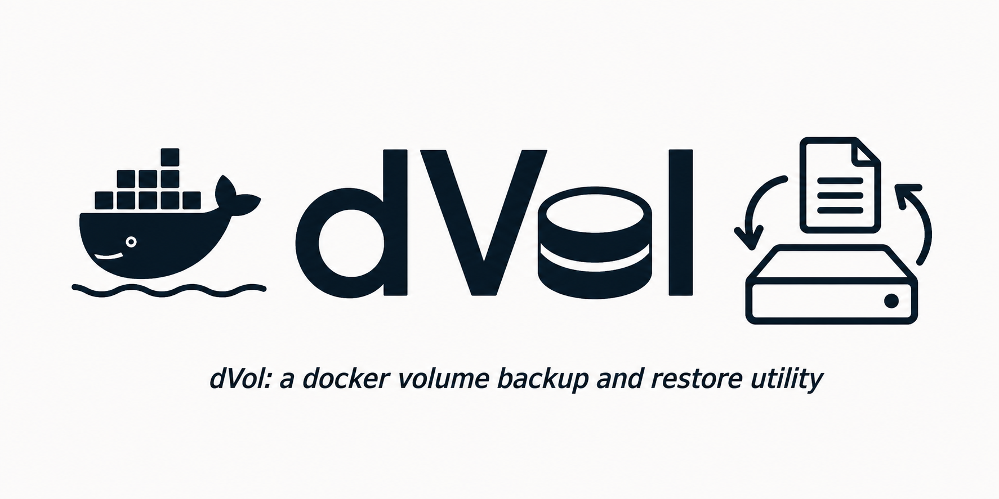

# dvol — Docker Volume Backup & Restore



`dvol` is a CLI tool for backing up and restoring Docker (or Podman) volumes via the Docker REST API.
It spins up a temporary Alpine container to safely access volume data, streams it as a tar archive,
and tears the container back down — no Docker CLI required, no shell scripts.

---

## Table of Contents

- [Features](#features)
- [Requirements](#requirements)
- [Installation](#installation)
- [Usage](#usage)
  - [Backup](#backup)
  - [Restore](#restore)
  - [List Volumes](#list-volumes)
  - [Delete a Volume](#delete-a-volume)
  - [Shell Completion](#shell-completion)
- [Global Flags](#global-flags)
- [Archive Formats](#archive-formats)
- [How It Works](#how-it-works)
- [Timeouts](#timeouts)
- [Changelog](#changelog)

---

## Features

- Backup a volume to `.tar`, `.tar.gz` / `.tgz`, or `.tar.xz` / `.txz`
- Restore a volume from any of the above formats
- Automatically stops and restarts containers that use the target volume
- Destroys and recreates the volume before restore to guarantee a clean state
- API-version negotiation (auto-detected from the daemon; can be pinned)
- Unix socket and TCP daemon support
- Bash and Zsh shell completion
- Structured logging (`none` / `error` / `info` / `debug`) written to `~/.local/state/dvol.log`

---

## Requirements

- Go 1.26+ (to build from source)
- A running Docker daemon accessible via `/var/run/docker.sock` or TCP
- `alpine:latest` available (pulled automatically if missing)

---

## Installation

```sh
git clone https://github.com/jeanfrancoisgratton/dvol.git
cd dvol/src/
./build.sh
```

The binary is placed in the project root (or wherever `build.sh` puts it). Copy it somewhere on your `$PATH`:

```sh
sudo cp dvol /usr/local/bin/
```

---

## Usage

### Backup

```sh
dvol backup <volume> <archive>
```

Creates a tar archive of the named volume. The archive path may omit the extension —
`.tar` is appended automatically if no recognised extension is present.

```sh
# Plain tar
dvol backup DB_VOL /tmp/db_backup.tar

# Gzip-compressed
dvol backup DB_VOL /tmp/db_backup.tar.gz

# XZ-compressed
dvol backup DB_VOL /tmp/db_backup.tar.xz
```

Any running containers that mount the volume are stopped before the backup and restarted afterwards.

---

### Restore

```sh
dvol restore <volume> <archive>
```

Restores a volume from a previously created archive. The volume is **destroyed and recreated**
before the data is written, guaranteeing a clean restore with no leftover state.

```sh
dvol restore DB_VOL /tmp/db_backup.tar
dvol restore DB_VOL /tmp/db_backup.tar.gz
dvol restore DB_VOL /tmp/db_backup.tar.xz
```

As with backup, attached running containers are stopped first and restarted on completion.

---

### List Volumes

```sh
dvol list
# or
dvol ls
```

Displays all Docker volumes in a formatted table (name, driver, creation time).

---

### Delete a Volume

```sh
dvol delete <volume>
```

Deletes the named volume. The volume must not be in use by any running container.

---

### Shell Completion

```sh
# Bash — current session
source <(dvol completion bash)

# Bash — persist
dvol completion bash | sudo tee /etc/bash_completion.d/dvol > /dev/null

# Zsh — current session
source <(dvol completion zsh)

# Zsh — persist
dvol completion zsh > ~/.zsh/_dvol
echo 'fpath=($HOME/.zsh $fpath)' >> ~/.zshrc
echo 'autoload -Uz compinit && compinit' >> ~/.zshrc
```

---

## Global Flags

| Flag | Short | Default | Description |
|------|-------|---------|-------------|
| `--host` | `-H` | `unix:///var/run/docker.sock` | Docker daemon address (unix socket or `tcp://host:port`) |
| `--image` | `-i` | `alpine:latest` | Image used for the temporary helper container |
| `--api` | `-a` | *(auto)* | Pin the Docker API version (e.g. `1.50`) |
| `--loglevel` | `-l` | `none` | Log verbosity: `none`, `error`, `info`, `debug` |
| `--quiet` | `-q` | `false` | Suppress all progress output |
| `--no-cleanup` | `-n` | `false` | Leave the temporary container in place after the operation |
| `--fastfail-timeout` | `-f` | `30` | HTTP handshake / connect timeout in **seconds** |
| `--timeout` | `-t` | `60` | Overall streaming timeout in **minutes** |

---

## Archive Formats

| Extension | Compression |
|-----------|-------------|
| `.tar` | None (raw tar stream) |
| `.tar.gz`, `.tgz` | Gzip |
| `.tar.xz`, `.txz` | XZ / LZMA2 |

If the archive path has no recognised extension, `.tar` is appended automatically.

---

## How It Works

Both backup and restore use the Docker daemon's `GET/PUT /containers/{id}/archive` endpoint,
which streams a tar directly to/from a path inside a container's filesystem.

1. **Detect** any running containers that mount the target volume and stop them.
2. **Spin up** a temporary Alpine container with the volume bound to `/data`.
3. **Backup:** `GET archive?path=/` — the daemon returns a tar rooted at `/` with entries
   like `data/pg_data/PG_VERSION …`. This is written verbatim (or gzip/xz-wrapped) to the
   archive file.
4. **Restore:** the volume is destroyed and recreated (clean slate), then `PUT archive?path=/`
   streams the tar back in. Because entries are rooted at `/`, `data/` expands to `/data/`
   inside the container, which is exactly where the volume is mounted.
5. **Cleanup:** the temp container is stopped and removed (unless `--no-cleanup`).
6. **Restart** any containers that were stopped in step 1.

The symmetric `path=/` on both ends is what prevents the classic double-nesting bug
(`/data/data/…`) that arises when backup reads from `path=/data` and restore writes to
`path=/data`.

---

## Timeouts

Two independent timeout knobs are provided because volume operations have two distinct
performance profiles:

- **`--fastfail-timeout` (`-f`)** — applies to individual HTTP requests that should complete
  quickly: container create/start/stop, volume delete/create, version negotiation. Default: 30 s.
- **`--timeout` (`-t`)** — applies to the full streaming transfer (backup read or restore write).
  For large volumes over a slow socket this may need to be raised. Default: 60 min.

---

## Changelog

| Version | Date | Notes |
|---------|------|-------|
| 2.10.10 | 2025.10.23 | Go 1.25.3, completed restore verbosity |
| 2.10.01 | 2025.10.10 | Completed verbosity |
| 2.10.00 | 2025.10.08 | Go version update, builddeps update, verbose output, added bash/zsh completion |
| 2.00.00 | 2025.08.24 | Full rewrite |
| 1.11.00 | 2025.06.19 | Fixed unix:// usage, added the `-q` flag |
| 1.10.00 | 2025.06.17 | Fixed backup; volumes are now destroyed before restore |
| 1.05.00 | 2025.06.11 | Code is now API version-agnostic |
| 1.02.00 | 2025.06.10 | Added volume listing function |
| 1.01.00 | 2025.06.09 | Added cleanup routines, packaging scripts cleanup |
| 1.00.00 | 2025.06.06 | Initial release |
